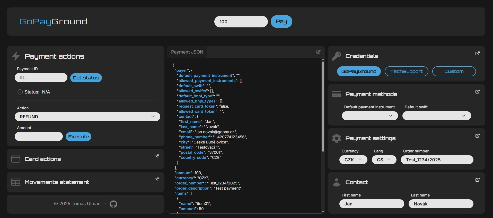
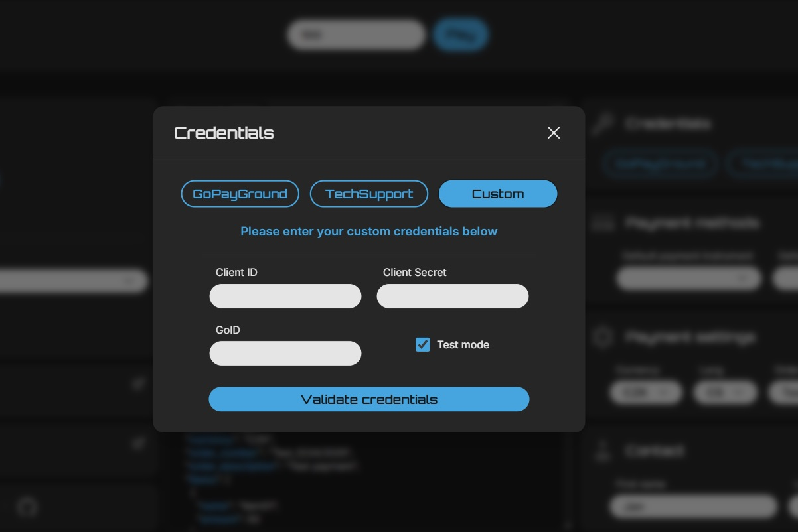
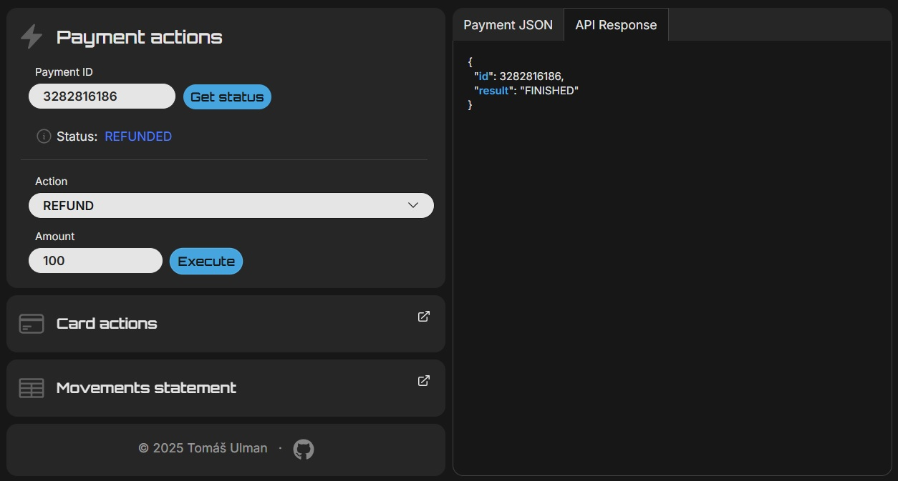

# GoPayGround

GoPayGround is an internal tool for testing and debugging the behavior of the GoPay payment gateway. It allows you to easily create and simulate payments and actions (refunds, recurrence, authorization...) using the GoPay SDK in both sandbox and production environments.

---

## 📈 Preview







---

## ⚖️ Usage

GoPayGround serves as a testing client for:

- Creating and simulating payments
- Performing payment actions (refund, recurrence, authorization...)
- Viewing payment methods, credentials validation, getting payment status and API responses

You can switch between these environments:

- GoPayGround (sandbox)
- TechSupport (production)
- Custom credentials

---

## ⚙️ Installation

### 📁 Clone the repository

```bash
git clone <repo-url>
cd gopayground
```

### ✨ Frontend

```bash
npm install
```

### ⛔️ Backend

```bash
cd backend
composer install
```

---

## 🚀 Running the app

Either manually:

```bash
# Start backend
cd backend
php -S localhost:8000

# Start frontend in a separate terminal
npm run dev
```

Or using a .bat script:

```bash
start.bat
```

---

## ⚠️ Notes

- Backend credentials are **not** included in the repo. You need to create `credentials.env` manually:

```
GOPAYGROUND_GOID=...
GOPAYGROUND_CLIENT_ID=...
GOPAYGROUND_CLIENT_SECRET=...

TECHSUPPORT_GOID=...
TECHSUPPORT_CLIENT_ID=...
TECHSUPPORT_CLIENT_SECRET=...
```

- The app is currently **local-only**, public deployment is planned for the future.
- No automated tests are implemented at this point.
- API errors are displayed directly in the response output.

---

> © 2025 Tomáš Ulman
> This tool is not an official GoPay product. It serves as an internal utility for development and testing.
