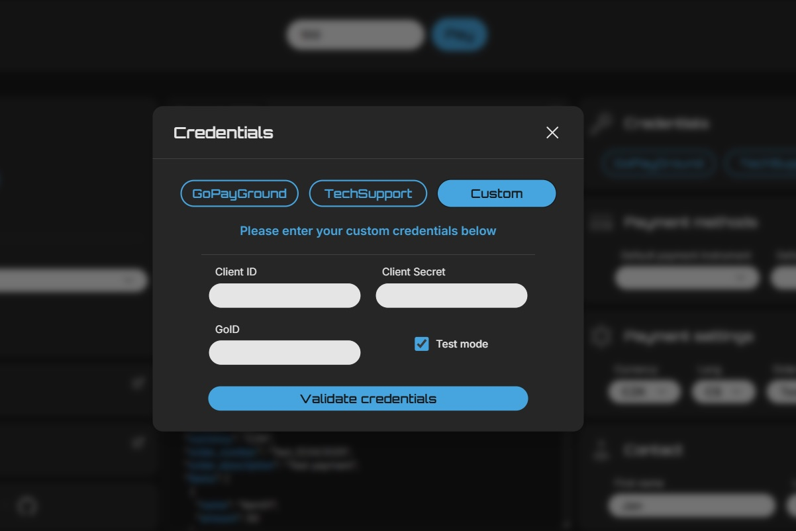
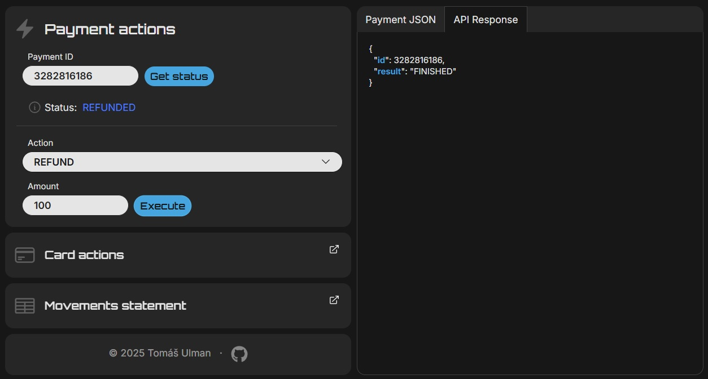

# GoPayGround

GoPayGround je interní nástroj pro testování a ladění chování platební brány GoPay. Umožňuje snadno spouštět testovací platby a akce (refund, recurrence, autorizace...) pomocí GoPay SDK v sandbox i produkčním prostředí.

---

## 📄 Obsah

- [Ukázka](#📈-ukázka)
- [Použití](#⚖%ef%b8%8f-použití)
- [Instalace](#⚙%ef%b8%8f-instalace)
- [Spuštění](#🚀-spuštění)
- [Struktura](#🗂%ef%b8%8f-struktura)
- [Poznámky](#⚠%ef%b8%8f-poznámky)

---

## 📈 Ukázka






---

## ⚖️ Použití

GoPayGround slouží jako testovací klient pro:

- Vytváření a simulaci plateb
- Ovládání platebních akcí (refundace, recurrence, autorizace)
- Validaci credentials, získání stavu platby a odpovědí

Prostředí lze přepínat mezi:

- GoPayGround (sandbox)
- TechSupport (produkce)
- Vlastní credentials

---

## ⚙️ Instalace

### 📁 Klonuj repozitář

```bash
git clone https://github.com/TomasUlman/GoPayGround.git
cd gopayground
```

### ✨ Frontend

```bash
npm install
```

### ⛔️ Backend

```bash
cd backend
composer install
```

---

## 🚀 Spuštění

Buď manuálně:

```bash
# Spusť backend
cd backend
php -S localhost:8000

# Spusť frontend v jiném terminálu
npm run dev
```

Nebo pomocí .bat skriptu:

```bash
start.bat
```

---

## ⚠️ Poznámky

- Backend credentials **nejsou** součástí repozitáře. Nutné vytvořit vle složce backend/api/ `credentials.env`:

```
GOPAYGROUND_GOID=...
GOPAYGROUND_CLIENT_ID=...
GOPAYGROUND_CLIENT_SECRET=...

TECHSUPPORT_GOID=...
TECHSUPPORT_CLIENT_ID=...
TECHSUPPORT_CLIENT_SECRET=...
```

- Nyní čistě **lokální aplikace**, do budoucna plánovaný deploy.
- Žádné testy zatím nejsou implementovány.
- Případné chyby API zobrazovány v odpovědi.

---

> © 2025 Tomáš Ulman
> Tato aplikace není oficiální produkt GoPay. Slouží jako interní testovací nástroj.
